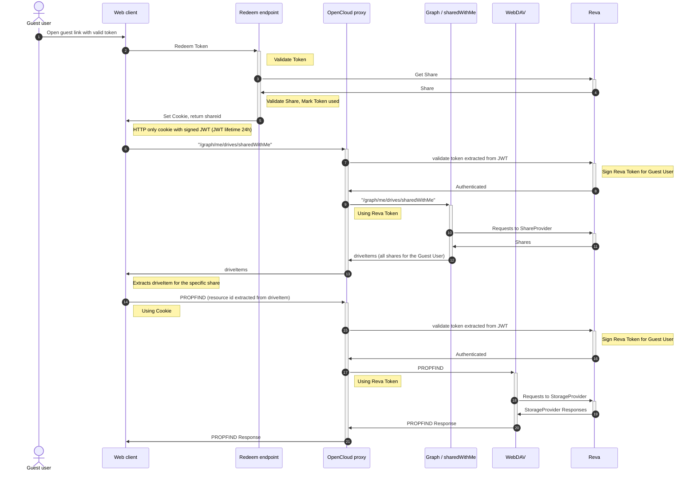
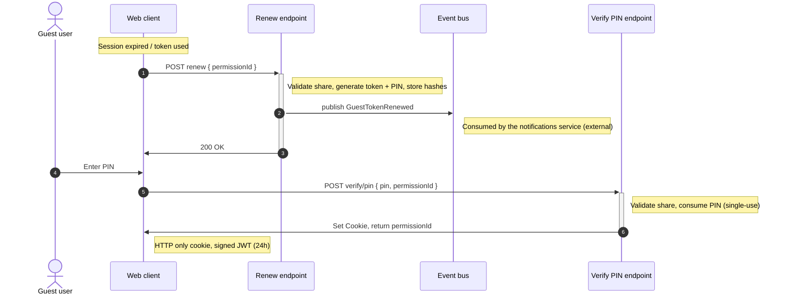

# auth-guest

The `auth-guest` service gives guest users access to a share without a full
OpenCloud account. When a share is created for a user of type
`USER_TYPE_GUEST`, the service issues a one-time guest link token; redeeming
that token exchanges it for a signed session cookie that authenticates the
guest.

When the session or the link token is no longer valid, the guest can *renew*:
the service issues a new link token together with a one-time PIN, both
delivered to the guest by email. The guest then either redeems the new link or
exchanges the PIN for a fresh session.

It is disabled by default. Set `OC_ENABLE_GUEST_LINKS=true` to enable the guest
links feature and start the service.

## Overview

- **Consumes** the share lifecycle events `ShareCreated`, `ShareRemoved` and
  `ShareExpired`.
- **Publishes** the `GuestTokenCreated` event (initial token) and the
  `GuestTokenRenewed` event (renewal, carrying the new token and the PIN), so
  the credentials can be delivered to the guest by the notifications service.
- Exposes unauthenticated endpoints to redeem a token, renew it and verify a
  PIN; redeeming a token or verifying a PIN sets a session cookie.
- Stores only hashes of the token secret and of the PIN and deletes the stored
  record when the share is removed or expires.

## Guest links flow

The following sequence diagram describes the guest links flow:

## Renewal and PIN flow

When the 24h session expires, or the link token was already used or has
expired, the web client calls `renew` with the `permissionId` it received in
the 401 response. The service validates the share, generates a new link token
and a 6-digit PIN, stores only their hashes and publishes the
`GuestTokenRenewed` event. Delivering the link and the PIN to the guest (by
email) is done by the notifications service consuming that event; it is not a
responsibility of `auth-guest`. The guest either clicks the link (`redeem`) or
enters the PIN in the still open browser tab (`verify/pin`); both set a fresh
24h session cookie.

## Token lifecycle

1. **Issue** — on the consumed `ShareCreated` event, where the grantee is a
   guest, the service generates a random secret and stores a record keyed by
   the hash of the share id. It then publishes the `GuestTokenCreated` event
   with the token.
2. **Redeem** — the guest posts the token to
   `POST /graph/v1beta1/extensions/org.libregraph/guestLinks/redeem` (alias
   `.../guestLinks/verify/token`).
   The service validates the token and the share, marks the token as used and
   returns a signed JWT session token in a cookie plus the share's
   `permissionId` in the response body. Tokens are single-use and valid for
   30 minutes; the session cookie lives for 24 hours.
3. **Renew** — the guest posts the `permissionId` to
   `POST /graph/v1beta1/extensions/org.libregraph/guestLinks/renew`.
   An existing record is required; otherwise the request fails with
   `tokenNotFound`. The service validates the share, generates a new link token
   and a 6-digit PIN (both valid for 30 minutes), stores only their hashes,
   resets the redeemed flag (invalidating the previous link) and publishes the
   `GuestTokenRenewed` event. If publishing fails, the previous record is
   restored.
4. **Verify PIN** — the guest posts the PIN and the `permissionId` to
   `POST /graph/v1beta1/extensions/org.libregraph/guestLinks/verify/pin`.
   The service validates the record and the share, compares the PIN against the
   stored argon2id hash and, on success, clears the PIN (single-use) and
   returns a signed JWT session token in a cookie plus the share's
   `permissionId`. Verifying the PIN does not consume the magic link.
5. **Cleanup** — on the consumed `ShareRemoved` or `ShareExpired` event, the
   stored record is deleted.

### Endpoints

All error responses have the body `{ "errorType": "<type>", "message": "<msg>", "permissionId": "<share-id>" }`.

| Endpoint | Request body | Success | Errors (status `errorType`) |
| --- | --- | --- | --- |
| `POST .../guestLinks/redeem` (alias: `.../guestLinks/verify/token`) | `{ "token": "<token>" }` | `200`, session cookie, `{ "permissionId": "<share-id>" }` | `400 invalidRequest`, `401 tokenInvalid`, `401 tokenExpired`, `404 tokenNotFound`, `409 tokenAlreadyRedeemed`, `404 shareNotFound`, `410 shareExpired`, `500 internalError` |
| `POST .../guestLinks/renew` | `{ "permissionId": "<share-id>" }` | `200` | `400 invalidRequest`, `404 tokenNotFound`, `404 shareNotFound`, `410 shareExpired`, `503 serviceUnavailable`, `500 internalError` |
| `POST .../guestLinks/verify/pin` | `{ "pin": "<pin>", "permissionId": "<share-id>" }` | `200`, session cookie, `{ "permissionId": "<share-id>" }` | `400 invalidRequest`, `401 pinInvalid`, `401 pinExpired`, `404 shareNotFound`, `410 shareExpired`, `500 internalError` |

## Configuration

The service is configured via `AUTH_GUEST_*` environment variables or a
`auth-guest.yaml` file.

Both transports are enabled by default: the service consumes and publishes
events and serves the HTTP endpoints. Either transport can be disabled:

- `AUTH_GUEST_EVENTS_DISABLED=true` — the service does not consume events
  (no tokens are created or cleaned up) and `renew` cannot publish its event,
  so it responds with `503 serviceUnavailable`.
- `AUTH_GUEST_HTTP_DISABLED=true` — the service does not serve the HTTP
  endpoints (`redeem`, `renew`, `verify/pin`).

The token and PIN lifetimes are fixed (30 minutes each) and are not
configurable.

Relevant options:

- `AUTH_GUEST_JWT_COOKIE_NAME`, `AUTH_GUEST_JWT_TTL` — session cookie name and
  lifetime.
- Guest session tokens are signed with a key derived from `OC_JWT_SECRET`. There
  is no separate secret to configure; rotating `OC_JWT_SECRET` invalidates all
  guest sessions.
- `AUTH_GUEST_TOKENS_STORAGE_ROOT` — where guest link token records are stored.
- `AUTH_GUEST_SERVICE_ACCOUNT_ID`, `AUTH_GUEST_SERVICE_ACCOUNT_SECRET` — service
  account used to query the gateway for share metadata.
- `AUTH_GUEST_NUM_CONSUMERS` — number of concurrent event consumers.
- `OC_REVA_GATEWAY` — CS3 gateway used to look up shares.
